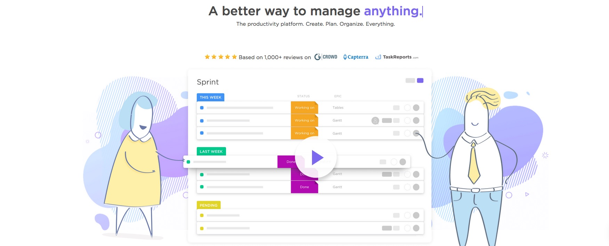

# Risorse utili by SkillsAndMore
All’interno di [SkillsAndMore](https://skillsandmore.org) sappiamo molto bene quanto sia importante avere a propria disposizione gli strumenti più utili ed efficaci per portare a termine il proprio lavoro e proprio per questo motivo abbiamo deciso di creare questa pagina all’interno della quale **andiamo a raccogliere tutte le nostre scelte personali**.

## Ecco gli Strumenti!

Per aiutarti nella consultazione di questa lunga pagina abbiamo preparato questo semplice menu che ti permetterà di saltare facilmente nella sezione di tuo interesse.

* [Gestione progetti](#gestione-progetti)

## Gestione progetti

Per quanto non possa sembrare una componente essenziale, essere in grado di gestire i progetti nel modo migliore è un aspetto molto importante nella vita di qualsiasi sviluppatore.

Inizialmente anche io non pensavo di averne bisogno, in fin dei conti si tratta soltanto di creare un’applicazione web giusto?!? 

**Sbagliato!**

La realizzazione del prodotto è soltanto un piccolo aspetto che riguarda il nostro lavoro perché abbiamo la necessità di metterci in contatto con i cliente, gestire i feedback, richiedere il copy da inserire nelle pagine e chissà quante altre cose.

Per questo motivo ho deciso di creare questa sezione, magari inizialmente avrai qualche dubbio sul loro utilizzo ma ti assicuro che con il tempo imparerai ad amarli.

### Asana

Personalmente **trovo Asana il miglior task manager di tutti i tempi**. Lo utilizzo ormai da diversi anni e la sua grafica pulita e le sue scorciatoie da tastiera sono la soluzione ideale per lo sviluppatore moderno.

Inoltre **puoi utilizzare questo strumento gratuitamente se hai un team inferiore alle 15 persone** e non hai bisogno degli strumenti avanzati.

Negli anni mi sono trovato a consigliare e a scrivere diverse volte su quanto ritengo utile questo strumento e oggi che permette di gestire i progetti sia in forma di to-do-list che di una bacheca non posso che consigliarlo ulteriormente dato che è in grado di adattarsi a qualsiasi tipo di utilizzo.

[Organizzati con Asana](https://asana.com/) :arrow_right:

### Trello

Se posso essere onesto con te, io **non ho mai capito come mai Trello piace così tanto**. Come puoi vedere dall’immagine sopra premette di gestire i progetti in board dove ogni colonna ha un singificato particolare.

Ovviamente le colonne possono adattarsi in base alle preferenze dei team ma generalmente abbiamo le classiche quattro colonne che vediamo qua sopra: Idee, Cose da Fare, Cose sulle quali stiamo lavorando e Cosa fatte.

Dal mio punto di vista questo risulta molto più confusionario dato che abbiamo sempre tutto a vista ma molto spesso mi trovo a doverlo usare perché Eugenio ha scoperto che ai clienti piace molto questo tipo di organizzazione.

Come dicevo, anche Asana recentemente ha rilasciato una funzionalità molto simile, e mi trovo a consigliarti questo strumento principalmente per poterti dare un’alternativa 😉

[Inizia a usare Trello](https://trello.com/andreabarghigiani/recommend) :arrow_right:

### Clickup

Clickup è recentemente entrato nel mio radar perché mi è stato consigliato da un frequentatore assiduo del [Meetup WordPress](https://www.meetup.com/it-IT/Palermo-WordPress-Meetup/) che organizzo ogni mese.

Abbiamo affrontato l'argomento perché ero un po' stanco di Asana e dei limiti imposti sul numero di utenti e mi è stato presentato perché con questo strumento hai la possibilità di avere gratuitamente un numero **illimitato di utenti** e anche sotto l'aspetto delle funzionalità è in grado di offrire moltissime cose che mi sono utili nel mio lavoro.

Se devo trovare un lato negativo è il fatto che **le opzioni di cloud sono limitate** al pagamento di un abbonamneto, anche se questo aspetto può essere tranquillamente evitato se si caricano i file su [Dropbox](https://skillsandmore.org/dropbox) o [Google Drive](https://www.google.com/drive/) all'interno dei commenti di un task.

Inoltre potrai invitare i tuoi clienti come Guest, aspetto molto utile soprattutto per i **piani a pagamento** perché questi non vengono contati come utenti attivi del tuo team e di conseguenza non dovrai pagare per il loro account.

Quindi se hai team di grandi dimensioni e non hai grosse necessità di condivisione file **Clickup è sicuramente un task manager che ti consiglio** soprattutto perché lo puoi **utilizzare ovunque** perché oltre alla web app offre desktop e mobile app per qualsiasi piattaforma :+1:

[Usa Clickup per i tuoi progetti](http://clickup.com/) :arrow_right:
