# Risorse utili by SkillsAndMore
All’interno di [SkillsAndMore](https://skillsandmore.org) sappiamo molto bene quanto sia importante avere a propria disposizione gli strumenti più utili ed efficaci per portare a termine il proprio lavoro e proprio per questo motivo abbiamo deciso di creare questa pagina all’interno della quale **andiamo a raccogliere tutte le nostre scelte personali**.

## Ecco gli Strumenti!

Per aiutarti nella consultazione di questa lunga pagina abbiamo preparato questo semplice menu che ti permetterà di saltare facilmente nella sezione di tuo interesse.

* [Editor di codice](#editor-di-codice)
* [Programmi di grafica](#programmi-di-grafica)
* [Strumenti di collaborazione](#strumenti-di-collaborazione)
* [Server & Hosting](#server-&-hosting)
* [Gestione clienti, feedback e contatti](#gestione-clienti-feedback-e-contatti)
* [Gestione progetti](#gestione-progetti)

## Editor di codice
Gli editor di codice sono i migliori amici degli sviluppatori, qua trovi due tra i nostri preferiti ma se pensi che ci siamo dimenticati qualcuno non esitare a farcelo scoprire [inviandoci una mail](https://skillsandmore.org/contatti).

### Atom

Atom è un editor di codice molto potente e versatile che permette di sviluppare praticamente in **qualsiasi linguaggio di programmazione**.

Grazie alla communità che si è sviluppata intorno a questo programma open source **abbiamo migliaia di estensioni che ci permettono di personalizzarlo**, ma alla prima installazione la sua interfaccia pulita e priva di pulsanti può spaventare un po’.

Per questo motivo abbiamo [creato un intero corso](https://skillsandmore.org/corso/padroneggia-il-potere-di-atom/) dedicato a questo programma che ti insegnerà come velocizzare al massimo il tuo lavoro e salvare molto tempo da poter spendere come preferisci!

[Scarica Atom](http://atom.io/) :arrow_right:

### PhpStorm
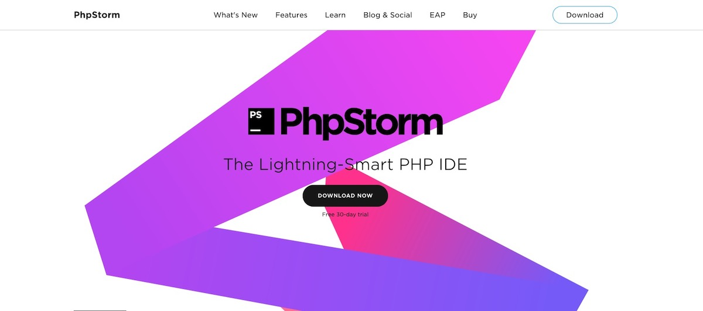

Se con il precedente editor abbiamo voluto premiare gli sforzi della community open source e le caratteristiche di un editor completo, quando si parla di PhpStorm affrontiamo proprio un argomento diverso!

Infatti non sarebbe corretto parlare di PhpStorm come un semplice editor, questo è **un potente IDE per chiunque si trovi a lavorare con PHP, anche con WordPress**! Infatti grazie a questo strumento potrai [lavorare molto più semplicemente con questo CMS](https://www.jetbrains.com/help/phpstorm/preparing-to-use-wordpress.html) attraverso le funzionalità integrate.

Oltre a questo c’è anche da dire che offre molti strumenti che amiamo per il debug del nostro codice e l’integrazione con VVV e gli altri sistemi di virtualizzazione risulta veramente un editor elegante e intuitivo.

Dimenticavo di dirti, se stai portando avanti un progetto open source, PhpStorm rilascia licenze gratuite per te e i componenti del tuo team :wink:

[Acquista PhpStorm](https://www.jetbrains.com/phpstorm/) :arrow_right:

### Visual Studio Code
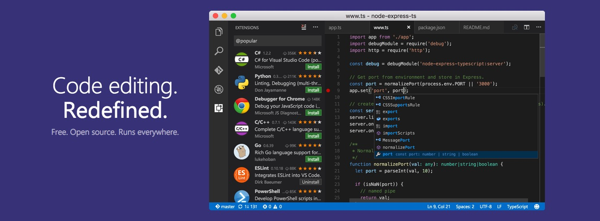

Questo è un editor che ho iniziato ad usare da circa un anno e ti confesso che **me ne sono innamorato immediatamente** perché per il mio stile di programmazione risulta essere il **perfetto mix tra un semplice editor di codice e un IDE**.

Come fanno in molti posiziono Visual Studio Code nel mezzo tra editor come Atom e IDE completi come PhpStorm.

Inizialmente ero un po' scettico all'inizio perché, in fin dei conti, Microsoft non ha mai dimostrato un grande interesse per noi sviluppatori web e i suoi prodotti (dallo sguardo di un Mac user come il sottoscritto) li ho sempre trovati macchinosi e inutilmente complessi.

Inutile dire che **mi sono dovuto ricredere**.

Non ho ancora scritto molto su questo editor all'interno del [blog di SkillsAndMore](https://skillsandmore.org/blog/) ma tornerò ad aggiornare sicuramente questa sezione perché non riesco a togliergli le mani di dosso :joy:

Visual Studio Code è **Open Source**, proprio come il precedente Atom, ed è ricchissimo di estensioni che ti permettono di adattarlo a qualsiasi tua necessità, anche se già in partenza è ricco di funzionalità che non ti fanno sentire perso.

Oltre a questo viene aggiornato costantemente a ritmi incredibili, ogni loro **release mensile** è ricca di nuove funzionalità che vengono spiegate benissimo all'interno dei loro changelog che puoi consultare all'interno della stessa applicazione o via [web](https://code.visualstudio.com/updates/).

Insomma che dire se non **inizia a testarlo il prima possibile** perché tanto è multipiattaforma e anche veloce 😃

[Usa Visual Studio Code](https://code.visualstudio.com/) :arrow_right:
## Programmi di grafica
So che probabilmente, dato il taglio da sviluppatori che abbiamo dato a SkillsAndMore, vedere dei suggerimenti sui programmi di grafico può sembrare un po’ strano.

Però dato che li uso **costantemente nel mio lavoro e li trovo incredibilmente utitli**, non potevo fare a meno di presentarteli.

Inoltre per seguire l’esempio della sezione precedente, anche in questo caso il primo strumento che ti consiglio arriva direttamente dalla comunità open source e il secondo sarà a pagamento.

### Gravit Designer
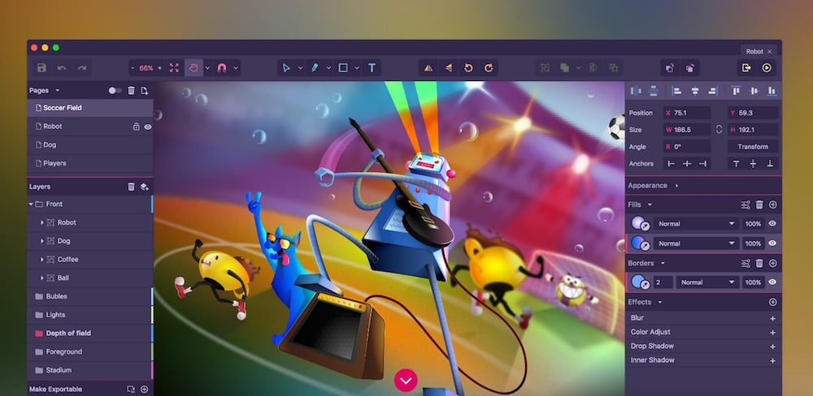

Ti confesso che aver trovato un’applicazione del genere **è veramente una grande sorpresa**! Sono anni che mi dico che non ho ancora il coraggio di passare a Linux perché mi mancano i miei programmi, ma devo dire che questa applicazione multipiattaforma è veramente piacevole.

Nata dallo stesso motore che ha portato in vita Atom, Electron, **risulta un’applicazione di grafica vettoriale che non vedevamo da molto tempo** nel mondo Open Source. Se mai ce ne fosse stata una.

Layout, precisione vettoriale, grafiche per la stampa e molti altri elementi possono essere facilmente creati da questo programma. Vuoi vederlo con i tuoi occhi, **hai la possibilità di provarlo direttamente online** prima di installarlo sul tuo computer, tanto è stato creato con HTML, CSS e JavaScript.
[Scarica Gravit Designer](https://designer.io/) :arrow_right:

### Affinity Designer

Se precedentemente ho voluto tessere le lodi di una comunità Open Source, ma in questo contesto **non posso ignorare un’azienda che ha deciso di infrangere un mercato**.

Infatti la Serif, l’azienda che produce Affinity Designer, propone questa **potentissima applicazione di grafica vettoriale e bitmap** a un prezzo incredibilmente accessibile: 49.99€. Oltre a questo ci vengono offerti aggiornamenti a vita senza la preoccupazione di dover pagare nuovamente la licenza al rilascio di una nuova versione.

In un mondo dove ormai si paga la stessa cifra ogni mese per utilizzare Photoshop e gli altri programmi della suite Adobe, sicuramente il prezzo è vantaggioro. Ma non è neanche l’unico punto a favore di questo strumento!

Non voglio scrivere troppo, ci sono ancora molti strumenti che voglio presentarti, per questo **ti lascio ai video tutorial** presenti sul loro [canale Vimeo](https://vimeo.com/channels/affinitydesigner).

[Acquista Affinity Designer](https://affinity.serif.com/it/designer/) :arrow_right:
## Strumenti di collaborazione
Negli ultimi anni abbiamo visto apparire moltissimi strumenti di collaborazione che **aiutano un team di sviluppatori** a portare a termine anche i progetti più impegnativi.

Ti ho [già presentato nel dettaglio questi strumenti in alcuni nostri articoli](https://skillsandmore.org/bitbucket-sviluppo-progetto/), ma dato che siamo all’interno di una pagina dedicate alle risorse per lo sviluppatore moderno credo proprio che averli qua a disposizione non possa che essere d’aiuto.

In questa sezione ti presento quelli specifici per il codice mentre nella prossima sezione parleremo più nello specifico di come organizzare il proprio lavoro, impostare delle deadline e comunicare con l’interno team!

### GitHub (facile siamo qua :joy:)
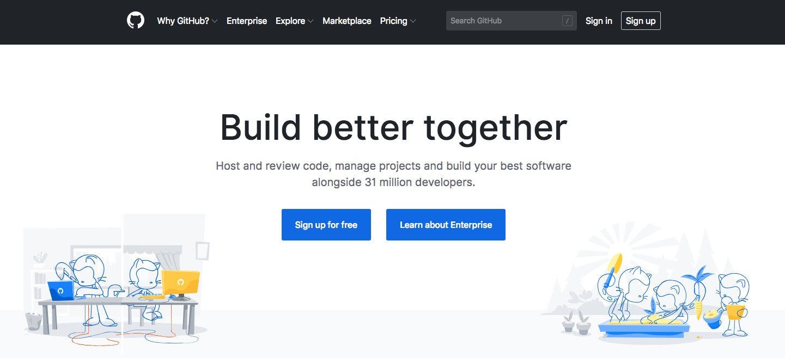

La piattaforma per la condivisione di codice per eccellenza, al suo interno di trovano interessanti progetti Open Source come il kernel Linux e WordPress.

Una tra le caratteristiche più belle offerte da questa piattaforma è la possibilità di avere **repository gratuiti per i nostri progetti**. Se stai curando un progetto pubblico e desideri che la comunità che popola questa piattaforma ne venga a conoscenza non puoi fare a meno che passare da questo strumento.

Puoi anche creare dei repository privati, previo abbonamento, ma se cerchi di risparmiare il più possibile sono sicuro che il prossimo strumento che ti consiglio farà al caso tuo 😉

[Scopri GitHub](https://github.com/) :arrow_right:

### BitBucket
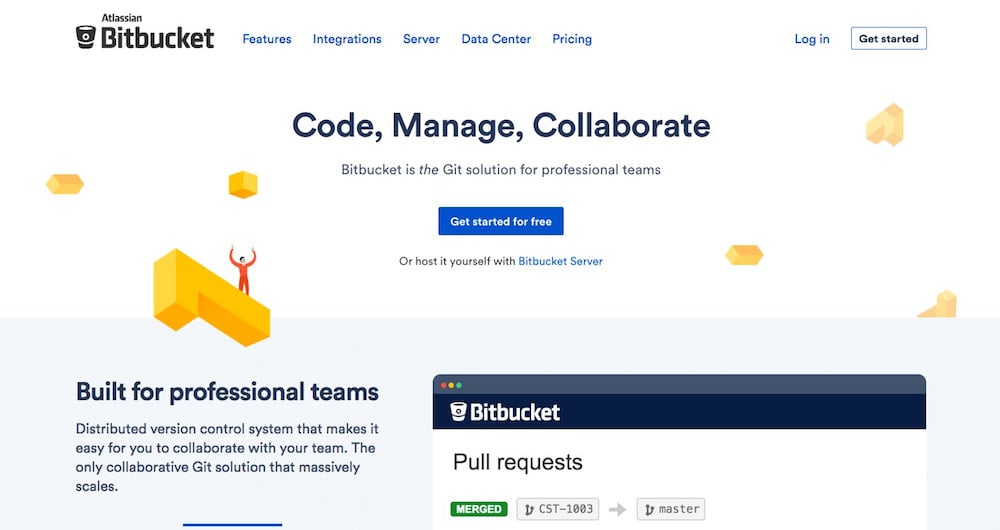

BitBucket è la piattaforma perfetta per tutti quei piccoli team che desiderano avere repository privati senza dover acquistare alcun abbonamento.

Infatti questa piattaforma ci offre la possibilità di creare un numero illimitato di repository privati fintanto che il nostro team resta sotto ai 5 componenti. Questo significa poter salvare tutti i progetti sui quali lavoriamo senza doverci preoccupare di mantenere nascosto il nostro codice.

Sembra troppo bello per essere vero? Visita adesso la homepage e registra il tuo account, non è un sogno.

[Registrati su BitBucket](https://bitbucket.org/) :arrow_right:

### CodePen
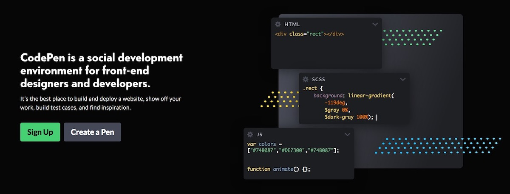

Se i due strumenti precedenti usavano Git per permetterti di collaborare con il tuo team, con questa piattaforma **non hai bisogno di alcun software aggiuntivo**.

Infatti questo strumento **funziona direttamente all’interno del tuo browser** ed è in grado di condividere qualsiasi codice FrontEnd tu stia sviluppando. Anche noi in SkillsAndMore utilizziamo spesso questo strumento perché ci permette di inserire velocemente degli esempi all’interno dei nostri articoli e corsi.

Proprio come succede in GitHub, se vuoi realizzare dei *Pen* pubblici (questo è il nome che hanno dato agli esempi che possiamo inserire) puoi crearne quanti desideri, se invece vuoi crearne di privati e **sbloccare decine di altre interessanti funzionalità** puoi sbloccarle con un semplice abbonamento.

[Registrati su BitBucket](https://bitbucket.org/) :arrow_right:
## Server & Hosting
Arriviamo forse a uno dei punti più cruciali della vita di uno sviluppatore web: dove posso trovare un buon server per ospitare il mio progetto?

Parlo di progetto perché onestamente non c’è motivo di distinguere tra il mio sito e il sito di un cliente perché in fin dei conti tutto quello che conta è la possibilità di offrire le miglior prestazioni per la tipologia di sito web cercando di mantenere contenuti i costi.

In quest’ultima sezione ho raccolto due suggerimenti che **provengono dalla mia esperienza personale e quella della mia web agency**, ma questo non significa che sono le scelte migliori, semplicemente quelle che abbiamo fatto noi!

Se non fossi fiducioso nel presentarti questi servizi non lo avrei fatto, ma ti confesso che per quanto riguarda assistenza, prestazioni e semplicità di utilizzo entrambi raggiungono ottimi risultati. Ovviamente si ottiene per quanto si paga.

### SiteGround
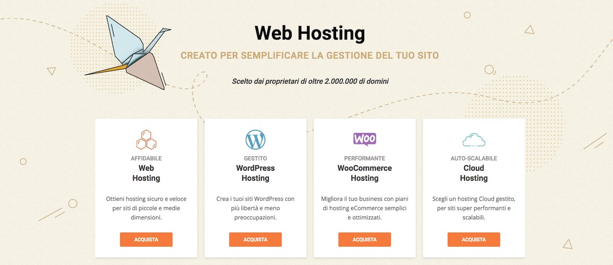

Sono sicuro che in questi ultimi anni hai sentito molto spesso parlare di SiteGround, molti articoli che avrai letto sono sicuramente stati pubblicati nel tentativo di vendere qualche affiliazione in più e nonostante che anche il mio sia un link di affiliazione, io ti parlo dalla mia esperienza personale!

Molto spesso ho sentito persone lamentarsi di questo hosting, ma personalmente devo dire che non mi ha mai deluso!

Il supporto è incredibilmente rapito e pronto a **rispondere a qualsiasi dubbio**, hanno i server in Italia e offrono dei prezzi davvero competitivi. Oltre a questo hanno sviluppato un sistema di cache che funziona alla perfezione con WordPress e che è semplicemente configurabile grazie a un plugin.

Ma non prendere soltanto le mie parole, naviga questo stesso sito e poi prendi la tua decisione 😉

[Hosting WordPress SiteGround](http://skillsandmore.org/siteground-wordpress) :arrow_right:
### Panthen

Poco fa ti ho presentato un hosting WordPress semplice da utilizzare e con delle prestazioni più che soddisfacenti, ma se sei alla ricerca dell’hosting che **ti permetterà di sviluppare in tutta tranquillità il sito per il tuo cliente** con Pantheon potrai dormire sonni tranquilli.

Pantheon non è soltanto un hosting incredibilmente perfomante, è anche in grado di soddisfare le necessità dello sviluppatore moderno!

Questo perché **potrai iniziare a lavorare creando un account gratuito** e portare a termine il tuo lavoro. Se poi il tuo cliente accetta di pagare l’hosting tu potrai continuare il tuo lavoro di mantenimento avendo a disposizione un **sito di sviluppo, uno di staging e quello pubblico all’interno della stessa macchina**!

Grazie a questa tecnologia non dovrai più diventare pazzo nel mantenere la versione di sviluppo e quella in produzione costantemente aggiornate, ci penserà Pantheon al posto tuo. Non dimentichiamoci che ogni sito viene gestito interamente via Git senza doverci preoccupare delle falle di sicurezza dell’FTP.

Insomma, iniziare a sviluppare il sito del tuo prossimo cliente è gratuito con Pantheon. Ci devi ancora pensare?

[Crea il tuo account Dev](http://pantheon.io/) :arrow_right:

## Gestione clienti, feedback e contatti
Essere in grado di gestire i nostri contatti nel migliore dei modi non ha assolutamente prezzo, è un’attività che ci permette di **risparmiare un sacco di tempo** e soprattutto di capire che cosa desidera avere il nostro cliente.

Per questo motivo in questa sezione, oltre a suggerirti un’interessantissima estensione per Chrome che **trasformerà il tuo Gmail in un vero CRM** ho deciso di inserirti anche due strumenti che ti aiuteranno nella gestione dei feedback dei tuoi clienti.

### Streak
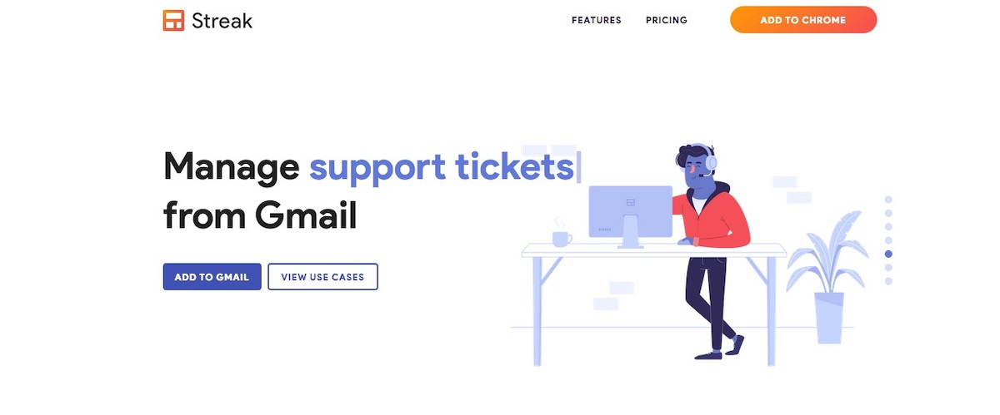

Se hai seguito i nostri corsi o letto un articolo in particolare nel nostro blog, ormai dovresti sapere che faccio il tifo per Firefox Developer Edition per tutta la mia attività di sviluppatore.

Al tempo stesso questo non è l’unico browser che utilizzo, in fin dei conti anche io uso il computer per svago 😉

Benché molte delle mie attività le svolgo all’interno di un classico Firefox, devo dire che per certe estensioni Chrome non lo batte nessuno! Lo dico un po’ a malincuore ma da quando ho scoperto Streak uso esclusivamente questo browser per inviare tutte le mie email, sia professionali che personali.

Questo perché le funzionalità che mette a disposizione questa estensione sono veramente molte e incredibilmente utili! Oltre a permetterci di gestire i nostri contatti e comunicazioni come all’interno di un vero CRM, offre anche utili strumenti per **ritardare l’invio delle email, sapere se qualcuno ha aperto le email inviate e anche notificarci se qualcuno non ha risposto** a un nostro messaggio dopo un tot di giorni.

Insomma, già con la sua versione gratuita questa estensione mi permette di risolvere la maggior parte dei problemi che posso incontrare e di usare Gmail, con la versione a pagamento poi ci permette di introdurre anche il nostro team!

[Usa Streak](https://skillsandmore.org/streak) :arrow_right:

### Invision App
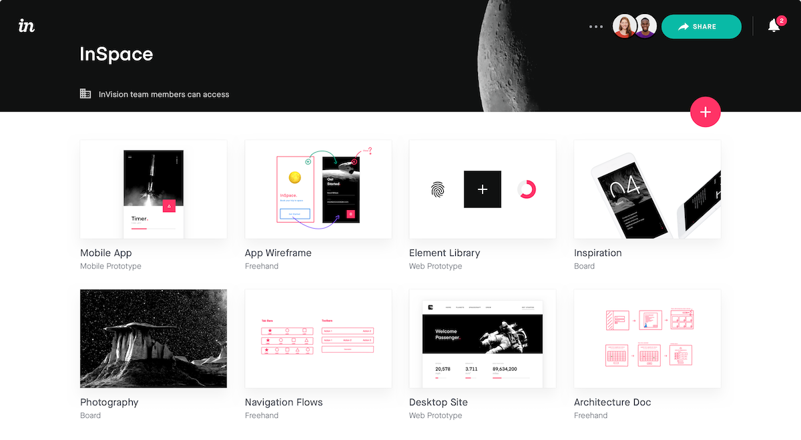

Riuscire a capire quale sia il layout che il nostro cliente desidera non è mai un compito facile, soprattutto quando ci scambiamo un sacco di email!

Lo strumento che ti sto per presentare esiste in molte forme e ha molti competitor, ma questo perché ci permette di fare una cosa molto interessante: ottenere feedback sulla nostra grafica **direttamente all’interno delle nostre bozze**.

InvisionApp è una web application che ti permetterà di caricare le immagini dei layout sui quali stai lavorando, anche `.psd`, e presentarli al tuo cliente come un vero e proprio sito web perché una volta aperto il link condiviso potrà navigare all’interno delle grafiche con la stessa naturalezza di un classico punta e clicca di un sito web.

La cosa ancora più bella è che potrà condividere con noi i propri dubbi **cliccando semplicemente sul punto che non lo convince**. Durante la realizzazione di questo portale io ho usato la stessa tecnica e ho ottenuto molti feedback dagli Skillati che mi hanno permesso di migliorare molto l’interfaccia.

Se pensi che questo possa essere uno strumento utile da usare, io ne sono convinto, **puoi iniziare gratuitamente sviluppando il tuo primo progetto**, se poi ci prendi gusto puoi sempre aggiornare il tuo abbonamento.

[Prova InvisionApp](https://www.invisionapp.com/) :arrow_right:

### ProjectHuddle
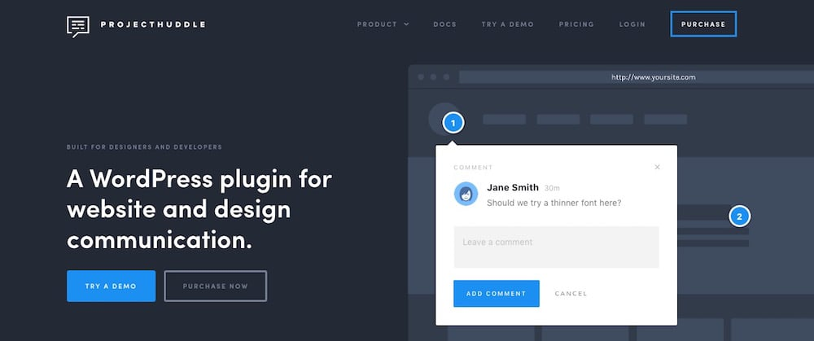

Se le possibilità messe a disposizione da InvisionApp ti sono interessate allora sono sicuro che questo strumento risulterà ancora più interessante, soprattutto se lavori con WordPress.

Il bello e il brutto di InvisionApp è la possibilità di lavorare con dei file grafici. Anche se recentemente hanno rilasciato uno strumento molto interessante dal punto di vista di uno sviluppatore, stiamo sempre parlando di prototipi grafici.

Invece con ProjectHuddle non soltanto saremo in grado di mostrare le nostre bozze grafiche e ottenere dei feedback precisi in modo molto veloce, ma **potremo anche far testare l’intero sito web durante le varie fasi di sviluppo**.

Infatti ritengo questo plugin WordPress un vero game changer, soprattutto se pensiamo che costa soltanto **$89 e che permette di pubblicare un numero illimitato di progetti**. Se la politica dei prezzi di InvisionApp ti è sembrata un po’ stretta, come al sottoscritto in fin dei conti, sono sicuro che troverai in ProjectHuddle **un’alternativa molto più elastica** e in grado di soddisfare le tue esigenze.

[Ottieni ProjectHuddle](http://skillsandmore.org/projecthuddle) :arrow_right:

## Gestione progetti

Per quanto non possa sembrare una componente essenziale, essere in grado di gestire i progetti nel modo migliore è un aspetto molto importante nella vita di qualsiasi sviluppatore.

Inizialmente anche io non pensavo di averne bisogno, in fin dei conti si tratta soltanto di creare un’applicazione web giusto?!? 

**Sbagliato!**

La realizzazione del prodotto è soltanto un piccolo aspetto che riguarda il nostro lavoro perché abbiamo la necessità di metterci in contatto con i cliente, gestire i feedback, richiedere il copy da inserire nelle pagine e chissà quante altre cose.

Per questo motivo ho deciso di creare questa sezione, magari inizialmente avrai qualche dubbio sul loro utilizzo ma ti assicuro che con il tempo imparerai ad amarli.

### Asana

Personalmente **trovo Asana il miglior task manager di tutti i tempi**. Lo utilizzo ormai da diversi anni e la sua grafica pulita e le sue scorciatoie da tastiera sono la soluzione ideale per lo sviluppatore moderno.

Inoltre **puoi utilizzare questo strumento gratuitamente se hai un team inferiore alle 15 persone** e non hai bisogno degli strumenti avanzati.

Negli anni mi sono trovato a consigliare e a scrivere diverse volte su quanto ritengo utile questo strumento e oggi che permette di gestire i progetti sia in forma di to-do-list che di una bacheca non posso che consigliarlo ulteriormente dato che è in grado di adattarsi a qualsiasi tipo di utilizzo.

[Organizzati con Asana](https://asana.com/) :arrow_right:

### Trello
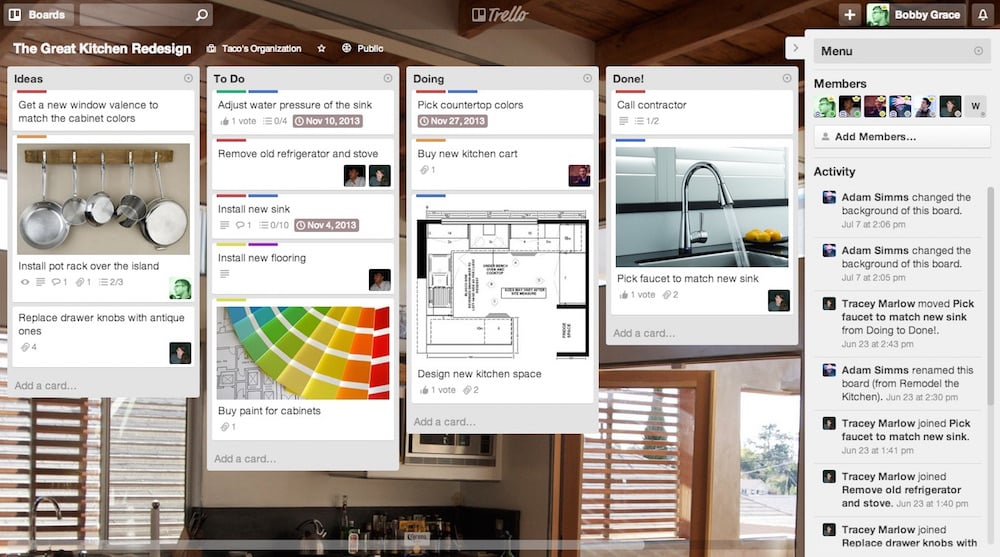

Se posso essere onesto con te, io **non ho mai capito come mai Trello piace così tanto**. Come puoi vedere dall’immagine sopra premette di gestire i progetti in board dove ogni colonna ha un singificato particolare.

Ovviamente le colonne possono adattarsi in base alle preferenze dei team ma generalmente abbiamo le classiche quattro colonne che vediamo qua sopra: Idee, Cose da Fare, Cose sulle quali stiamo lavorando e Cosa fatte.

Dal mio punto di vista questo risulta molto più confusionario dato che abbiamo sempre tutto a vista ma molto spesso mi trovo a doverlo usare perché Eugenio ha scoperto che ai clienti piace molto questo tipo di organizzazione.

Come dicevo, anche Asana recentemente ha rilasciato una funzionalità molto simile, e mi trovo a consigliarti questo strumento principalmente per poterti dare un’alternativa 😉

[Inizia a usare Trello](https://trello.com/andreabarghigiani/recommend) :arrow_right:
