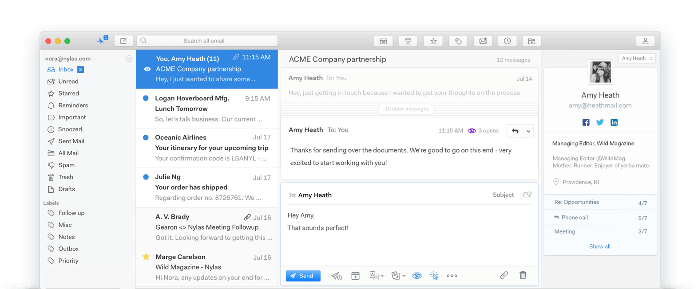

# Risorse utili by SkillsAndMore
All’interno di [SkillsAndMore](https://skillsandmore.org) sappiamo molto bene quanto sia importante avere a propria disposizione gli strumenti più utili ed efficaci per portare a termine il proprio lavoro e proprio per questo motivo abbiamo deciso di creare questa pagina all’interno della quale **andiamo a raccogliere tutte le nostre scelte personali**.

## Ecco gli Strumenti!

Per aiutarti nella consultazione di questa lunga pagina abbiamo preparato questo semplice menu che ti permetterà di saltare facilmente nella sezione di tuo interesse.

* [Gestione clienti, feedback e contatti](#gestione-clienti-feedback-e-contatti)
* [Gestione progetti](#gestione-progetti)

## Gestione clienti, feedback e contatti
Essere in grado di gestire i nostri contatti nel migliore dei modi non ha assolutamente prezzo, è un’attività che ci permette di **risparmiare un sacco di tempo** e soprattutto di capire che cosa desidera avere il nostro cliente.

Per questo motivo in questa sezione, oltre a suggerirti un’interessantissima estensione per Chrome che **trasformerà il tuo Gmail in un vero CRM** ho deciso di inserirti anche due strumenti che ti aiuteranno nella gestione dei feedback dei tuoi clienti.

### Streak

Se hai seguito i nostri corsi o letto un articolo in particolare nel nostro blog, ormai dovresti sapere che faccio il tifo per Firefox Developer Edition per tutta la mia attività di sviluppatore.

Al tempo stesso questo non è l’unico browser che utilizzo, in fin dei conti anche io uso il computer per svago 😉

Benché molte delle mie attività le svolgo all’interno di un classico Firefox, devo dire che per certe estensioni Chrome non lo batte nessuno! Lo dico un po’ a malincuore ma da quando ho scoperto Streak uso esclusivamente questo browser per inviare tutte le mie email, sia professionali che personali.

Questo perché le funzionalità che mette a disposizione questa estensione sono veramente molte e incredibilmente utili! Oltre a permetterci di gestire i nostri contatti e comunicazioni come all’interno di un vero CRM, offre anche utili strumenti per **ritardare l’invio delle email, sapere se qualcuno ha aperto le email inviate e anche notificarci se qualcuno non ha risposto** a un nostro messaggio dopo un tot di giorni.

Insomma, già con la sua versione gratuita questa estensione mi permette di risolvere la maggior parte dei problemi che posso incontrare e di usare Gmail, con la versione a pagamento poi ci permette di introdurre anche il nostro team!

[Usa Streak](https://skillsandmore.org/streak) :arrow_right:

### Mailspring

Recentemente ho smesso di usare la versione web di Gmail, non tanto perché non trovavo valore nel suo utilizzo piuttosto ero stanco di dover tenere aperto Chrome soltanto per la gestione della mia mail.

Su Mac esistono moltissimi client email che si possono utilizzare e molti di questi hanno delle interessantissime funzionalità, **però io cercavo delle applicazioni multipiattaforma che potessi presentare a chiunque**.

Ed ecco che ti incontro [Mailspring](https://getmailspring.com/), un client email **Open Source** e multipiattaforma :joy:

Certo, alcune funzionalità sono limitate ed è possibile ottenere un accesso illimitato attivando il loro abbonamento. 

Vogliamo o no supportare un po' questi sviluppatori che realizzano dei prodotti fantastici? In fin dei conti si parla di un abbonamento di $8 al mese, il tuo account Netflix costa molto di più ed è la cosa più lontana dalla produttività.

Parlo di produttività perché Mailspring mi permette di **ottimizzare il tempo che passo a gestire la mia mail** grazie alle sue funzionalità:
* crea template per le risposte più comuni
* scopri maggiori informazioni sulla persona che stai contattando
* crea alert per ricordarti delle tue email di follow-up
* traccia le aperture delle email
* traccia quali sono i link che vengono cliccati

Ci sono molte altre funzionalità che mi hanno fatto scegliere Mailspring come client email di default ma lascio a te il compito di scoprirle tutte :wink:

[Prova ora Mailspring](https://getmailspring.com/) :arrow_right:

### Invision App

Riuscire a capire quale sia il layout che il nostro cliente desidera non è mai un compito facile, soprattutto quando ci scambiamo un sacco di email!

Lo strumento che ti sto per presentare esiste in molte forme e ha molti competitor, ma questo perché ci permette di fare una cosa molto interessante: ottenere feedback sulla nostra grafica **direttamente all’interno delle nostre bozze**.

InvisionApp è una web application che ti permetterà di caricare le immagini dei layout sui quali stai lavorando, anche `.psd`, e presentarli al tuo cliente come un vero e proprio sito web perché una volta aperto il link condiviso potrà navigare all’interno delle grafiche con la stessa naturalezza di un classico punta e clicca di un sito web.

La cosa ancora più bella è che potrà condividere con noi i propri dubbi **cliccando semplicemente sul punto che non lo convince**. Durante la realizzazione di questo portale io ho usato la stessa tecnica e ho ottenuto molti feedback dagli Skillati che mi hanno permesso di migliorare molto l’interfaccia.

Se pensi che questo possa essere uno strumento utile da usare, io ne sono convinto, **puoi iniziare gratuitamente sviluppando il tuo primo progetto**, se poi ci prendi gusto puoi sempre aggiornare il tuo abbonamento.

[Prova InvisionApp](https://www.invisionapp.com/) :arrow_right:

### ProjectHuddle

Se le possibilità messe a disposizione da InvisionApp ti sono interessate allora sono sicuro che questo strumento risulterà ancora più interessante, soprattutto se lavori con WordPress.

Il bello e il brutto di InvisionApp è la possibilità di lavorare con dei file grafici. Anche se recentemente hanno rilasciato uno strumento molto interessante dal punto di vista di uno sviluppatore, stiamo sempre parlando di prototipi grafici.

Invece con ProjectHuddle non soltanto saremo in grado di mostrare le nostre bozze grafiche e ottenere dei feedback precisi in modo molto veloce, ma **potremo anche far testare l’intero sito web durante le varie fasi di sviluppo**.

Infatti ritengo questo plugin WordPress un vero game changer, soprattutto se pensiamo che costa soltanto **$89 e che permette di pubblicare un numero illimitato di progetti**. Se la politica dei prezzi di InvisionApp ti è sembrata un po’ stretta, come al sottoscritto in fin dei conti, sono sicuro che troverai in ProjectHuddle **un’alternativa molto più elastica** e in grado di soddisfare le tue esigenze.

[Ottieni ProjectHuddle](http://skillsandmore.org/projecthuddle) :arrow_right:

## Gestione progetti

Per quanto non possa sembrare una componente essenziale, essere in grado di gestire i progetti nel modo migliore è un aspetto molto importante nella vita di qualsiasi sviluppatore.

Inizialmente anche io non pensavo di averne bisogno, in fin dei conti si tratta soltanto di creare un’applicazione web giusto?!? 

**Sbagliato!**

La realizzazione del prodotto è soltanto un piccolo aspetto che riguarda il nostro lavoro perché abbiamo la necessità di metterci in contatto con i cliente, gestire i feedback, richiedere il copy da inserire nelle pagine e chissà quante altre cose.

Per questo motivo ho deciso di creare questa sezione, magari inizialmente avrai qualche dubbio sul loro utilizzo ma ti assicuro che con il tempo imparerai ad amarli.

### Asana

Personalmente **trovo Asana il miglior task manager di tutti i tempi**. Lo utilizzo ormai da diversi anni e la sua grafica pulita e le sue scorciatoie da tastiera sono la soluzione ideale per lo sviluppatore moderno.

Inoltre **puoi utilizzare questo strumento gratuitamente se hai un team inferiore alle 15 persone** e non hai bisogno degli strumenti avanzati.

Negli anni mi sono trovato a consigliare e a scrivere diverse volte su quanto ritengo utile questo strumento e oggi che permette di gestire i progetti sia in forma di to-do-list che di una bacheca non posso che consigliarlo ulteriormente dato che è in grado di adattarsi a qualsiasi tipo di utilizzo.

[Organizzati con Asana](https://asana.com/) :arrow_right:

### Trello

Se posso essere onesto con te, io **non ho mai capito come mai Trello piace così tanto**. Come puoi vedere dall’immagine sopra premette di gestire i progetti in board dove ogni colonna ha un singificato particolare.

Ovviamente le colonne possono adattarsi in base alle preferenze dei team ma generalmente abbiamo le classiche quattro colonne che vediamo qua sopra: Idee, Cose da Fare, Cose sulle quali stiamo lavorando e Cosa fatte.

Dal mio punto di vista questo risulta molto più confusionario dato che abbiamo sempre tutto a vista ma molto spesso mi trovo a doverlo usare perché Eugenio ha scoperto che ai clienti piace molto questo tipo di organizzazione.

Come dicevo, anche Asana recentemente ha rilasciato una funzionalità molto simile, e mi trovo a consigliarti questo strumento principalmente per poterti dare un’alternativa 😉

[Inizia a usare Trello](https://trello.com/andreabarghigiani/recommend) :arrow_right:

### Clickup

Clickup è recentemente entrato nel mio radar perché mi è stato consigliato da un frequentatore assiduo del [Meetup WordPress](https://www.meetup.com/it-IT/Palermo-WordPress-Meetup/) che organizzo ogni mese.

Abbiamo affrontato l'argomento perché ero un po' stanco di Asana e dei limiti imposti sul numero di utenti e mi è stato presentato perché con questo strumento hai la possibilità di avere gratuitamente un numero **illimitato di utenti** e anche sotto l'aspetto delle funzionalità è in grado di offrire moltissime cose che mi sono utili nel mio lavoro.

Se devo trovare un lato negativo è il fatto che **le opzioni di cloud sono limitate** al pagamento di un abbonamneto, anche se questo aspetto può essere tranquillamente evitato se si caricano i file su [Dropbox](https://skillsandmore.org/dropbox) o [Google Drive](https://www.google.com/drive/) all'interno dei commenti di un task.

Inoltre potrai invitare i tuoi clienti come Guest, aspetto molto utile soprattutto per i **piani a pagamento** perché questi non vengono contati come utenti attivi del tuo team e di conseguenza non dovrai pagare per il loro account.

Quindi se hai team di grandi dimensioni e non hai grosse necessità di condivisione file **Clickup è sicuramente un task manager che ti consiglio** soprattutto perché lo puoi **utilizzare ovunque** perché oltre alla web app offre desktop e mobile app per qualsiasi piattaforma :+1:

[Usa Clickup per i tuoi progetti](http://clickup.com/) :arrow_right:
