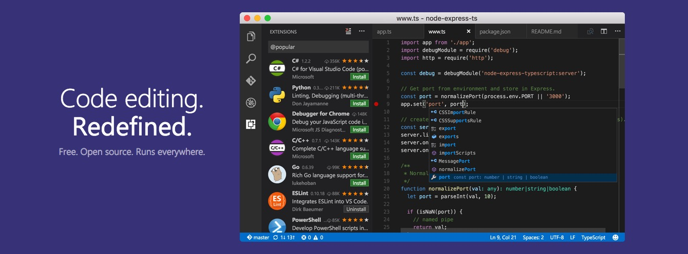

# Editor di codice
Gli editor di codice sono i migliori amici degli sviluppatori, qua trovi due tra i nostri preferiti ma se pensi che ci siamo dimenticati qualcuno non esitare a farcelo scoprire [inviandoci una mail](https://skillsandmore.org/contatti).

## Atom

Atom è un editor di codice molto potente e versatile che permette di sviluppare praticamente in **qualsiasi linguaggio di programmazione**.

Grazie alla communità che si è sviluppata intorno a questo programma open source **abbiamo migliaia di estensioni che ci permettono di personalizzarlo**, ma alla prima installazione la sua interfaccia pulita e priva di pulsanti può spaventare un po’.

Per questo motivo abbiamo [creato un intero corso](https://skillsandmore.org/corso/padroneggia-il-potere-di-atom/) dedicato a questo programma che ti insegnerà come velocizzare al massimo il tuo lavoro e salvare molto tempo da poter spendere come preferisci!

[Scarica Atom](http://atom.io/){: .btn .btn-green }

## PhpStorm

Se con il precedente editor abbiamo voluto premiare gli sforzi della community open source e le caratteristiche di un editor completo, quando si parla di PhpStorm affrontiamo proprio un argomento diverso!

Infatti non sarebbe corretto parlare di PhpStorm come un semplice editor, questo è **un potente IDE per chiunque si trovi a lavorare con PHP, anche con WordPress**! Infatti grazie a questo strumento potrai [lavorare molto più semplicemente con questo CMS](https://www.jetbrains.com/help/phpstorm/preparing-to-use-wordpress.html) attraverso le funzionalità integrate.

Oltre a questo c’è anche da dire che offre molti strumenti che amiamo per il debug del nostro codice e l’integrazione con VVV e gli altri sistemi di virtualizzazione risulta veramente un editor elegante e intuitivo.

Dimenticavo di dirti, se stai portando avanti un progetto open source, PhpStorm rilascia licenze gratuite per te e i componenti del tuo team :wink:

[Acquista PhpStorm](https://www.jetbrains.com/phpstorm/){: .btn .btn-green }

## Visual Studio Code

Questo è un editor che ho iniziato ad usare da circa un anno e ti confesso che **me ne sono innamorato immediatamente** perché per il mio stile di programmazione risulta essere il **perfetto mix tra un semplice editor di codice e un IDE**.

Come fanno in molti posiziono Visual Studio Code nel mezzo tra editor come Atom e IDE completi come PhpStorm.

Inizialmente ero un po' scettico all'inizio perché, in fin dei conti, Microsoft non ha mai dimostrato un grande interesse per noi sviluppatori web e i suoi prodotti (dallo sguardo di un Mac user come il sottoscritto) li ho sempre trovati macchinosi e inutilmente complessi.

Inutile dire che **mi sono dovuto ricredere**.

Non ho ancora scritto molto su questo editor all'interno del [blog di SkillsAndMore](https://skillsandmore.org/blog/) ma tornerò ad aggiornare sicuramente questa sezione perché non riesco a togliergli le mani di dosso :joy:

Visual Studio Code è **Open Source**, proprio come il precedente Atom, ed è ricchissimo di estensioni che ti permettono di adattarlo a qualsiasi tua necessità, anche se già in partenza è ricco di funzionalità che non ti fanno sentire perso.

Oltre a questo viene aggiornato costantemente a ritmi incredibili, ogni loro **release mensile** è ricca di nuove funzionalità che vengono spiegate benissimo all'interno dei loro changelog che puoi consultare all'interno della stessa applicazione o via [web](https://code.visualstudio.com/updates/).

Insomma che dire se non **inizia a testarlo il prima possibile** perché tanto è multipiattaforma e anche veloce 😃

[Usa Visual Studio Code](https://code.visualstudio.com/){: .btn .btn-green }
