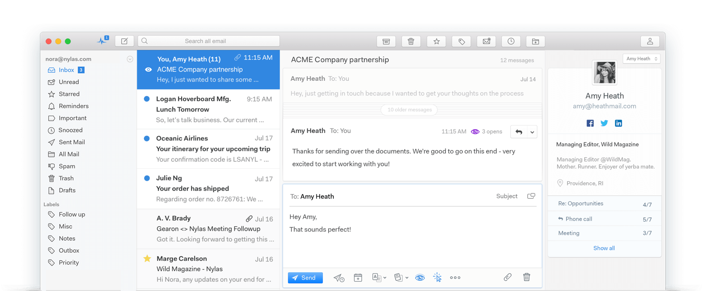

# Gestione clienti, feedback e contatti
Essere in grado di gestire i nostri contatti nel migliore dei modi non ha assolutamente prezzo, è un’attività che ci permette di **risparmiare un sacco di tempo** e soprattutto di capire che cosa desidera avere il nostro cliente.

Per questo motivo in questa sezione, oltre a suggerirti un’interessantissima estensione per Chrome che **trasformerà il tuo Gmail in un vero CRM** ho deciso di inserirti anche due strumenti che ti aiuteranno nella gestione dei feedback dei tuoi clienti.

## Streak

Se hai seguito i nostri corsi o letto un articolo in particolare nel nostro blog, ormai dovresti sapere che faccio il tifo per Firefox Developer Edition per tutta la mia attività di sviluppatore.

Al tempo stesso questo non è l’unico browser che utilizzo, in fin dei conti anche io uso il computer per svago 😉

Benché molte delle mie attività le svolgo all’interno di un classico Firefox, devo dire che per certe estensioni Chrome non lo batte nessuno! Lo dico un po’ a malincuore ma da quando ho scoperto Streak uso esclusivamente questo browser per inviare tutte le mie email, sia professionali che personali.

Questo perché le funzionalità che mette a disposizione questa estensione sono veramente molte e incredibilmente utili! Oltre a permetterci di gestire i nostri contatti e comunicazioni come all’interno di un vero CRM, offre anche utili strumenti per **ritardare l’invio delle email, sapere se qualcuno ha aperto le email inviate e anche notificarci se qualcuno non ha risposto** a un nostro messaggio dopo un tot di giorni.

Insomma, già con la sua versione gratuita questa estensione mi permette di risolvere la maggior parte dei problemi che posso incontrare e di usare Gmail, con la versione a pagamento poi ci permette di introdurre anche il nostro team!

[Usa Streak](https://skillsandmore.org/streak){: .btn .btn-green }

## Mailspring

Recentemente ho smesso di usare la versione web di Gmail, non tanto perché non trovavo valore nel suo utilizzo piuttosto ero stanco di dover tenere aperto Chrome soltanto per la gestione della mia mail.

Su Mac esistono moltissimi client email che si possono utilizzare e molti di questi hanno delle interessantissime funzionalità, **però io cercavo delle applicazioni multipiattaforma che potessi presentare a chiunque**.

Ed ecco che ti incontro [Mailspring](https://getmailspring.com/), un client email **Open Source** e multipiattaforma :joy:

Certo, alcune funzionalità sono limitate ed è possibile ottenere un accesso illimitato attivando il loro abbonamento. 

Vogliamo o no supportare un po' questi sviluppatori che realizzano dei prodotti fantastici? In fin dei conti si parla di un abbonamento di $8 al mese, il tuo account Netflix costa molto di più ed è la cosa più lontana dalla produttività.

Parlo di produttività perché Mailspring mi permette di **ottimizzare il tempo che passo a gestire la mia mail** grazie alle sue funzionalità:
* crea template per le risposte più comuni
* scopri maggiori informazioni sulla persona che stai contattando
* crea alert per ricordarti delle tue email di follow-up
* traccia le aperture delle email
* traccia quali sono i link che vengono cliccati

Ci sono molte altre funzionalità che mi hanno fatto scegliere Mailspring come client email di default ma lascio a te il compito di scoprirle tutte :wink:

[Prova ora Mailspring](https://getmailspring.com/){: .btn .btn-green }

## Invision App

Riuscire a capire quale sia il layout che il nostro cliente desidera non è mai un compito facile, soprattutto quando ci scambiamo un sacco di email!

Lo strumento che ti sto per presentare esiste in molte forme e ha molti competitor, ma questo perché ci permette di fare una cosa molto interessante: ottenere feedback sulla nostra grafica **direttamente all’interno delle nostre bozze**.

InvisionApp è una web application che ti permetterà di caricare le immagini dei layout sui quali stai lavorando, anche `.psd`, e presentarli al tuo cliente come un vero e proprio sito web perché una volta aperto il link condiviso potrà navigare all’interno delle grafiche con la stessa naturalezza di un classico punta e clicca di un sito web.

La cosa ancora più bella è che potrà condividere con noi i propri dubbi **cliccando semplicemente sul punto che non lo convince**. Durante la realizzazione di questo portale io ho usato la stessa tecnica e ho ottenuto molti feedback dagli Skillati che mi hanno permesso di migliorare molto l’interfaccia.

Se pensi che questo possa essere uno strumento utile da usare, io ne sono convinto, **puoi iniziare gratuitamente sviluppando il tuo primo progetto**, se poi ci prendi gusto puoi sempre aggiornare il tuo abbonamento.

[Prova InvisionApp](https://www.invisionapp.com/){: .btn .btn-green }

## ProjectHuddle

Se le possibilità messe a disposizione da InvisionApp ti sono interessate allora sono sicuro che questo strumento risulterà ancora più interessante, soprattutto se lavori con WordPress.

Il bello e il brutto di InvisionApp è la possibilità di lavorare con dei file grafici. Anche se recentemente hanno rilasciato uno strumento molto interessante dal punto di vista di uno sviluppatore, stiamo sempre parlando di prototipi grafici.

Invece con ProjectHuddle non soltanto saremo in grado di mostrare le nostre bozze grafiche e ottenere dei feedback precisi in modo molto veloce, ma **potremo anche far testare l’intero sito web durante le varie fasi di sviluppo**.

Infatti ritengo questo plugin WordPress un vero game changer, soprattutto se pensiamo che costa soltanto **$89 e che permette di pubblicare un numero illimitato di progetti**. Se la politica dei prezzi di InvisionApp ti è sembrata un po’ stretta, come al sottoscritto in fin dei conti, sono sicuro che troverai in ProjectHuddle **un’alternativa molto più elastica** e in grado di soddisfare le tue esigenze.

[Ottieni ProjectHuddle](http://skillsandmore.org/projecthuddle){: .btn .btn-green }
