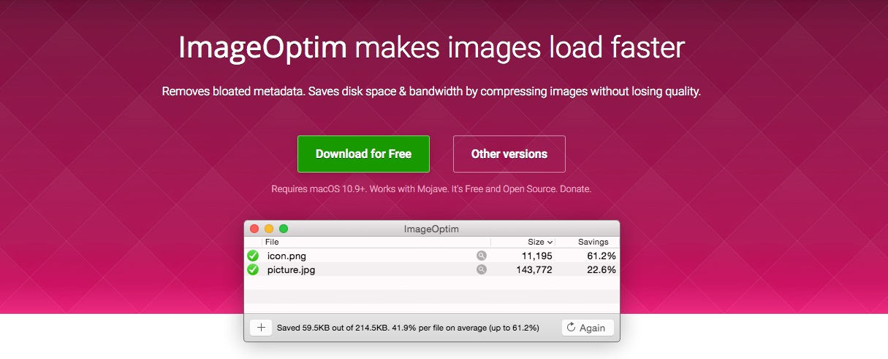

# Ottimizzazioni

All'interno di questa sezione troverai alcuni consigli sugli strumenti che ti permetteranno di ottimizzare tutti i componenti relativi al tuo progetto. Siano queste immagini, video, il tuo codice o tutte

## Ottimizzazione Immagini

### ImageOptim

Non importa quanto tu sia bravo con i tuoi programmi di grafica, se vuoi caricare le tue immagini online **devi ottimizzarle** e per fare questo da anni uso una sola app che non mi ha mai deluso: **[ImageOptim](https://imageoptim.com/mac)**.

Per chi non usa OSX ho raccolto delle alternative che non ho testato personalmente ma che sembrano promettenti:
* [Emage](https://emage.js.org/) - Electron App che sembra molto promettente,
* [ImageMagick](https://imagemagick.org/) - molto più che una semplice applicazione per ottimizzare le immagini ma dovrai utilizzarla da terminale per scoprire le sue infinite capacità.
