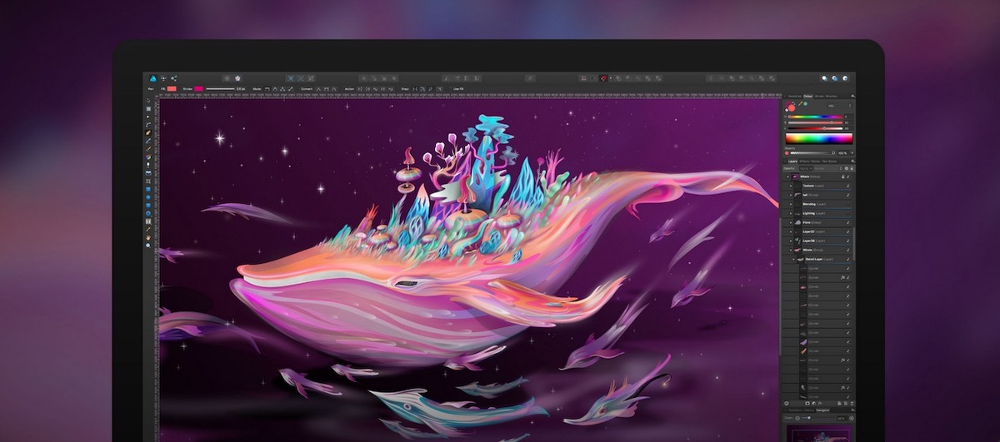

# Programmi di grafica
So che probabilmente, dato il taglio da sviluppatori che abbiamo dato a SkillsAndMore, vedere dei suggerimenti sui programmi di grafico può sembrare un po’ strano.

Però dato che li uso **costantemente nel mio lavoro e li trovo incredibilmente utitli**, non potevo fare a meno di presentarteli.

Inoltre per seguire l’esempio della sezione precedente, anche in questo caso il primo strumento che ti consiglio arriva direttamente dalla comunità open source e il secondo sarà a pagamento.

## Gravit Designer

Ti confesso che aver trovato un’applicazione del genere **è veramente una grande sorpresa**! Sono anni che mi dico che non ho ancora il coraggio di passare a Linux perché mi mancano i miei programmi, ma devo dire che questa applicazione multipiattaforma è veramente piacevole.

Nata dallo stesso motore che ha portato in vita Atom, Electron, **risulta un’applicazione di grafica vettoriale che non vedevamo da molto tempo** nel mondo Open Source. Se mai ce ne fosse stata una.

Layout, precisione vettoriale, grafiche per la stampa e molti altri elementi possono essere facilmente creati da questo programma. Vuoi vederlo con i tuoi occhi, **hai la possibilità di provarlo direttamente online** prima di installarlo sul tuo computer, tanto è stato creato con HTML, CSS e JavaScript.
[Scarica Gravit Designer](https://designer.io/){: .btn .btn-green }

## Affinity Designer

Se precedentemente ho voluto tessere le lodi di una comunità Open Source, ma in questo contesto **non posso ignorare un’azienda che ha deciso di infrangere un mercato**.

Infatti la Serif, l’azienda che produce Affinity Designer, propone questa **potentissima applicazione di grafica vettoriale e bitmap** a un prezzo incredibilmente accessibile: 49.99€. Oltre a questo ci vengono offerti aggiornamenti a vita senza la preoccupazione di dover pagare nuovamente la licenza al rilascio di una nuova versione.

In un mondo dove ormai si paga la stessa cifra ogni mese per utilizzare Photoshop e gli altri programmi della suite Adobe, sicuramente il prezzo è vantaggioro. Ma non è neanche l’unico punto a favore di questo strumento!

Non voglio scrivere troppo, ci sono ancora molti strumenti che voglio presentarti, per questo **ti lascio ai video tutorial** presenti sul loro [canale Vimeo](https://vimeo.com/channels/affinitydesigner).

[Acquista Affinity Designer](https://affinity.serif.com/it/designer/){: .btn .btn-green }
