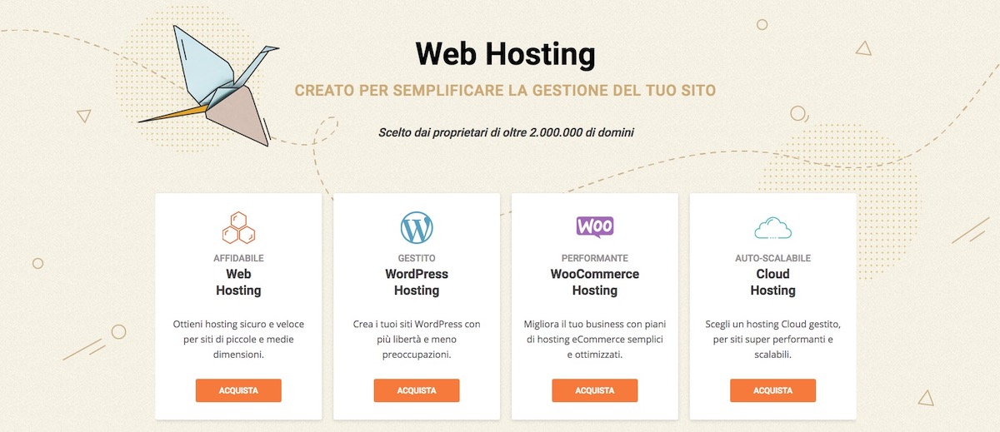

## Server & Hosting
Arriviamo forse a uno dei punti più cruciali della vita di uno sviluppatore web: dove posso trovare un buon server per ospitare il mio progetto?

Parlo di progetto perché onestamente non c’è motivo di distinguere tra il mio sito e il sito di un cliente perché in fin dei conti tutto quello che conta è la possibilità di offrire le miglior prestazioni per la tipologia di sito web cercando di mantenere contenuti i costi.

In quest’ultima sezione ho raccolto due suggerimenti che **provengono dalla mia esperienza personale e quella della mia web agency**, ma questo non significa che sono le scelte migliori, semplicemente quelle che abbiamo fatto noi!

Se non fossi fiducioso nel presentarti questi servizi non lo avrei fatto, ma ti confesso che per quanto riguarda assistenza, prestazioni e semplicità di utilizzo entrambi raggiungono ottimi risultati. Ovviamente si ottiene per quanto si paga.
### SiteGround

Sono sicuro che in questi ultimi anni hai sentito molto spesso parlare di SiteGround, molti articoli che avrai letto sono sicuramente stati pubblicati nel tentativo di vendere qualche affiliazione in più e nonostante che anche il mio sia un link di affiliazione, io ti parlo dalla mia esperienza personale!

Molto spesso ho sentito persone lamentarsi di questo hosting, ma personalmente devo dire che non mi ha mai deluso!

Il supporto è incredibilmente rapito e pronto a **rispondere a qualsiasi dubbio**, hanno i server in Italia e offrono dei prezzi davvero competitivi. Oltre a questo hanno sviluppato un sistema di cache che funziona alla perfezione con WordPress e che è semplicemente configurabile grazie a un plugin.

Ma non prendere soltanto le mie parole, naviga questo stesso sito e poi prendi la tua decisione 😉

[Hosting WordPress SiteGround](http://skillsandmore.org/siteground-wordpress) :arrow_right:

## Panthen

Poco fa ti ho presentato un hosting WordPress semplice da utilizzare e con delle prestazioni più che soddisfacenti, ma se sei alla ricerca dell’hosting che **ti permetterà di sviluppare in tutta tranquillità il sito per il tuo cliente** con Pantheon potrai dormire sonni tranquilli.

Pantheon non è soltanto un hosting incredibilmente perfomante, è anche in grado di soddisfare le necessità dello sviluppatore moderno!

Questo perché **potrai iniziare a lavorare creando un account gratuito** e portare a termine il tuo lavoro. Se poi il tuo cliente accetta di pagare l’hosting tu potrai continuare il tuo lavoro di mantenimento avendo a disposizione un **sito di sviluppo, uno di staging e quello pubblico all’interno della stessa macchina**!

Grazie a questa tecnologia non dovrai più diventare pazzo nel mantenere la versione di sviluppo e quella in produzione costantemente aggiornate, ci penserà Pantheon al posto tuo. Non dimentichiamoci che ogni sito viene gestito interamente via Git senza doverci preoccupare delle falle di sicurezza dell’FTP.

Insomma, iniziare a sviluppare il sito del tuo prossimo cliente è gratuito con Pantheon. Ci devi ancora pensare?

[Crea il tuo account Dev](http://pantheon.io/) :arrow_right:
