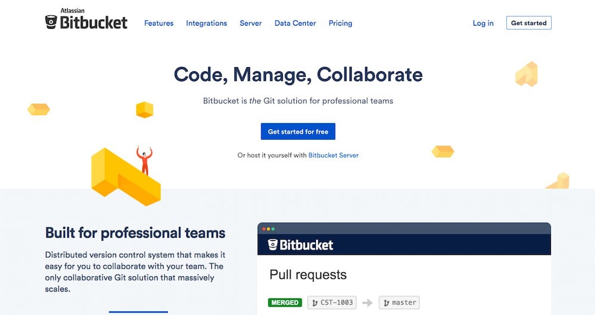

# Strumenti di collaborazione
Negli ultimi anni abbiamo visto apparire moltissimi strumenti di collaborazione che **aiutano un team di sviluppatori** a portare a termine anche i progetti più impegnativi.

Ti ho [già presentato nel dettaglio questi strumenti in alcuni nostri articoli](https://skillsandmore.org/bitbucket-sviluppo-progetto/), ma dato che siamo all’interno di una pagina dedicate alle risorse per lo sviluppatore moderno credo proprio che averli qua a disposizione non possa che essere d’aiuto.

In questa sezione ti presento quelli specifici per il codice mentre nella prossima sezione parleremo più nello specifico di come organizzare il proprio lavoro, impostare delle deadline e comunicare con l’interno team!

## GitHub (facile siamo qua 😂)

La piattaforma per la condivisione di codice per eccellenza, al suo interno di trovano interessanti progetti Open Source come il kernel Linux e WordPress.

Una tra le caratteristiche più belle offerte da questa piattaforma è la possibilità di avere **repository gratuiti per i nostri progetti**. Se stai curando un progetto pubblico e desideri che la comunità che popola questa piattaforma ne venga a conoscenza non puoi fare a meno che passare da questo strumento.

Puoi anche creare dei repository privati, previo abbonamento, ma se cerchi di risparmiare il più possibile sono sicuro che il prossimo strumento che ti consiglio farà al caso tuo 😉

[Scopri GitHub](https://github.com/){: .btn .btn-green }

## BitBucket

BitBucket è la piattaforma perfetta per tutti quei piccoli team che desiderano avere repository privati senza dover acquistare alcun abbonamento.

Infatti questa piattaforma ci offre la possibilità di creare un numero illimitato di repository privati fintanto che il nostro team resta sotto ai 5 componenti. Questo significa poter salvare tutti i progetti sui quali lavoriamo senza doverci preoccupare di mantenere nascosto il nostro codice.

Sembra troppo bello per essere vero? Visita adesso la homepage e registra il tuo account, non è un sogno.

[Registrati su BitBucket](https://bitbucket.org/){: .btn .btn-green }

## CodePen

Se i due strumenti precedenti usavano Git per permetterti di collaborare con il tuo team, con questa piattaforma **non hai bisogno di alcun software aggiuntivo**.

Infatti questo strumento **funziona direttamente all’interno del tuo browser** ed è in grado di condividere qualsiasi codice FrontEnd tu stia sviluppando. Anche noi in SkillsAndMore utilizziamo spesso questo strumento perché ci permette di inserire velocemente degli esempi all’interno dei nostri articoli e corsi.

Proprio come succede in GitHub, se vuoi realizzare dei *Pen* pubblici (questo è il nome che hanno dato agli esempi che possiamo inserire) puoi crearne quanti desideri, se invece vuoi crearne di privati e **sbloccare decine di altre interessanti funzionalità** puoi sbloccarle con un semplice abbonamento.

[Registrati su BitBucket](https://bitbucket.org/){: .btn .btn-green }
